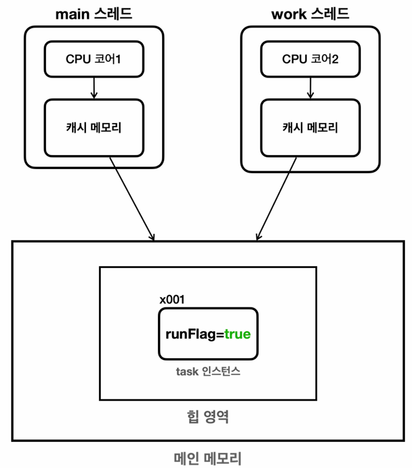

- 이 내용은 [인프런-김영한의 실전 자바 - 고급 1편, 멀티스레드와 동시성
](https://www.inflearn.com/course/%EA%B9%80%EC%98%81%ED%95%9C%EC%9D%98-%EC%8B%A4%EC%A0%84-%EC%9E%90%EB%B0%94-%EA%B3%A0%EA%B8%89-1/dashboard) 강의를 듣고 정리 및 학습한 내용입니다.

---

# 1. 프로세스와 스레드

- 멀티 테스킹: 하나의 컴퓨터 머신에서 동시에 여러 작업을 수행하는 능력; `소프트웨어 관점`
- 멀티 스레딩: 하나의 프로세스 내에서 여러 스레드가 동시에 작업을 수행하는 것; `하드웨어(CPU의 하이퍼스레딩) & 소프트웨어(프로세스가 생성하는 스레드) 관점`
- 멀티 프로세싱: CPU의 여러 코어를 사용하여 동시에 프로세스를 수행하는 것; `하드웨어 관점`
- 추가적인 프로세스와 스레드는 따로 정리한 [여기](https://github.com/jiyongYoon/study_note/tree/master/cs/process-thread)를 참고한다.

> 스레드를 나누면 컨택스트 스위칭 비용이 발생하기 때문에 무조건 많다고 좋은 것은 아니다.
> 
> 결국 연산 관련한 `CPU 바운드 작업`과 파일, 네트워크 작업 등의`I/O 바운드 작업`중 더 많이 집중된 연산들이 있는 것에 따라 스레드 개수를 정하는 것이 필요하다.

# 2. Java에서 스레드 생성 및 사용

## 1) Thread 클래스 상속

- [코드](/src/thread/start/HelloThreadMain.java)
- `start()` -> 스레드 생성 -> 스택 할당 -> `run()` 메서드 호출
- 스레드 간의 실행 순서는 보장하지 않음

### 스레드 종류

- [코드](/src/thread/start/DaemonThreadMain.java)
1. 사용자 스레드(non-daemon)
    - 작업이 완료될 때까지 실행
    - 모든 user 스레드가 종료되면 JVM도 종료됨
2. 데몬 스레드(daemon)
    - 백그라운드에서 실행되는 스레드
    - JVM이 종료될 때 실행 완료를 기다리지 않고 종료됨

## 2) Runnable 인터페이스 구현

- [코드](/src/thread/start/HelloRunnableMain.java)
- Thread 클래스 상속과 동작은 동일
- java의 `상속`과 `구현`의 장단점이 그대로 적용됨
- 여러가지 사용 방법
  - [정적 중첩 클래스](/src/thread/start/InnerRunnableMainV1.java)
  - [익명 클래스](/src/thread/start/InnerRunnableMainV2.java)
  - [직접 전달](/src/thread/start/InnerRunnableMainV3.java)
  - [람다식](/src/thread/start/InnerRunnableMainV4.java)

# 3. 스레드 제어와 생명 주기

- [코드](/src/thread/control/ThreadInfoMain.java)

## 1) 스레드 상태
- [코드](/src/thread/control/ThreadStateMain.java)
- `NEW`: 생성된 상태
- `RUNNABLE`: 실행 가능한 상태; OS의 스케쥴링 큐에 들어있는 상태 (언제든 실행될 수 있음)
- `BLOCKED`: 자원(동기화 락)을 기다리는 상태; `synchronized` 블록에 진입하기 위해 대기 중인 상태로 `interrupt()`에도 못깨어남
- `WAITING`: 다른 스레드의 작업을 기다리는 상태; `interrupt()` 깨어남
- `TIMED_WAITING`: 지정된 시간 동안 대기하는 상태; `WAITING`에 시간개념만 추가됨
- `TERMINATED`: 종료된 상태; stack frame이 모두 제거된 상태로 정상적으로 종료되거나 예외가 발생하여 종료된 경우

## 2) 스레드 제어 - join()
- [코드](/src/thread/control/join/JoinMainV3.java)
- 스레드가 종료될 때까지 대기(Waiting)하여 무작위로 실행되는 스레드의 종료를 보장할 수 있음

## 3) 스레드 제어 - interrupt()
- [코드](/src/thread/control/interrupt/ThreadStopMainV2.java)
- `WAITING`, `TIMED_WAITING`, `BLOCKED` 상태의 스레드에 대해 interrupt() 메서드를 호출하면 `InterruptedException` 예외가 발생하여 스레드를 제어할 수 있음

# 4. 메모리 가시성 - volatile

- 스레드에는 CPU 코어와 붙어 있는 캐시 메모리가 있는데, 모든 스레드의 작업은 캐시 메모리에만 반영이 된다. 이는 스레드 한정이다. 캐시 메모리가 훨씬 빠르기 때문에 사용한다.
- 여러 스레드에 값을 공유하려면 메인 메모리의 힙 영역에 반영되어야 한다.
- 메인 메모리에 언제 반영될지는 CPU와 OS 동작에 따라 다르다.
- [코드](/src/thread/control/volatile/VolatileCounterMain.java)
  - volatile 키워드를 사용하면 매번 메인 메모리에 동기화를 강제하여 값을 가시화한다.
  - 대신 성능을 손해본다.

# 5. 동기화 - synchronized

- 같은 자원(리소스)에 여러 스레드가 동시에 접근할 때 발생하는 것이 `동시성 문제`
  - e.g. 인스턴스의 멤버 변수 등
- [코드](/src/thread/sync/BankMain.java)
- 특정 작업은 한 스레드만 접근해서 작업해야 하는 구간이 있는데, 이를 `임계 영역(critical section)`이라고 함
- synchronized 키워드를 사용하여 임계 영역을 설정할 수 있으며, 하나의 스레드만 호출할 수 있음
  - 때문에 범위를 최소화 하여 성능을 최대한 높여야 함
- `락`을 얻어야 들어갈 수 있으며, 나올 때 `락`을 반납함
- 나머지 스레드는 `BLOCKED` 상태가 되며 `interrupt()`에도 당장 반응하지 않는 무한대기상태가 됨
- 또한 대기하는 스레드가 여러개가 되면 락을 획득하는 순서는 보장되지 않음
> 뮤텍스 락을 구현한 java 키워드임

# 6. 고급 동기화 - concurrent.Lock
- [코드](/src/thread/sync/BankAccountV4.java)
- `ReentrantLock`은 뮤텍스 락의 개념을 '소프트웨어'적으로 구현한 `java.util.concurrent.locks.Lock.java` 인터페이스의 구현체
  - `synchronized` 키워드의 단점 (무한대기, 공정성 없음)을 보완
  - `BLOCKED` 상태가 아닌 `WAITING` 상태로 대기하는 `대기 큐`가 존재하여 큐에서 스레드들을 관리함

# 7. 생산자 소비자 문제
- [1. 큐에 작업을 넣고 빼는 것은 동기화를 하였으나, 대기하지 않아 데이터가 버려짐](/src/thread/bounded/BoundedQueueV1.java)
- [2. 대기하도록 하였으나, 락을 가진 애가 무한루프에 빠짐](/src/thread/bounded/BoundedQueueV2.java)
- [3. `wait()`와 `notify()`를 이용해서 락을 반납하고 대기 및 깨우게 하여 문제 해결하였으나, 순차적으로 돌아가기 때문에 작업 처리를 못하는 스레드도 락을 획득하는 비효율 있음](/src/thread/bounded/BoundedQueueV3.java)
- [4. `wait()`와 `notify()`를 `Lock` 인터페이스와 `ReentrantLock` 구현체를 사용해서 그대로 재구현](/src/thread/bounded/BoundedQueueV4.java)
- [5. 생산자와 소비자 스레드 대기공간을 나누어서 작업에 필요한 스레드군을 깨우게 하여 효율성 재고](/src/thread/bounded/BoundedQueueV5.java)
- [6. 5번 코드를 구현해놓은 `java.util.concurrent.BlockingQueue` 인터페이스의 구현체인 `ArrayBlockingQueue`를 사용하여 구현](/src/thread/bounded/BoundedQueueV6_1.java)
- [7. `ArrayBlockingQueue`의 다른 메서드 사용 - 1](/src/thread/bounded/BoundedQueueV6_2.java)
- [7. `ArrayBlockingQueue`의 다른 메서드 사용 - 2](/src/thread/bounded/BoundedQueueV6_3.java)
- [7. `ArrayBlockingQueue`의 다른 메서드 사용 - 3](/src/thread/bounded/BoundedQueueV6_4.java)

## 1) BlockingQueue
### 특징
1. 큐에 요소를 추가&제거하는 작업 자체는 락을 획득해야 수행할 수 있다.
2. 때문에 FIFO 특성이 유지되며, 모든 큐 작업은 원자적 동작이 보장된다.
3. 큐에 요소를 넣는 작업(생산자)이 완료되면, 큐에서 요소를 빼기 위해 대기하고 있는 소비자 스레드를 깨운다.
4. 큐에서 요소를 빼는 작업(소비자)이 완료되면, 큐에 요소를 넣기 위해 대기하고 있는 생산자 스레드를 깨운다.

### 메서드 별 동작
|Operation| Throws Exception(예외 던짐)                 | Blocks(무작정 대기) | Special Value(즉시 반환) | Times Out(특정 시간만큼 대기)        |
|:---|:----------------------------------------|:---------------|:---------------|:-----------------------------|
|Insert(추가)| add(e)   └─IllegalStateException     | put(e)         |  offer(e) → false | offer(e, time, unit) → false |
|Remove(제거)| remove()   └─NoSuchElementException  | take()         | poll() → null  | poll(time, unit) → null      |
|Examine(관찰)| element()   └─NoSuchElementException | -              | peek() → null | -                            |

## 2) BlockingQueue 인터페이스의 대표적인 구현체
### (1) ArrayBlockingQueue
- 배열 기반으로 구현되어 있고, 버퍼의 크기가 고정되어 있음
### (2) LinkedBlockingQueue
- 링크 기반으로 구현되어 있고, 버퍼 크기를 고정할 수도, 또는 무한하게 사용할 수도 있음

> 큐에 생산 또는 소비하는 한 쪽 스레드가 1개더라도 BlockingQueue를 사용해야 하는가?
> 
> -> Yes.   
> -> 큐의 내부 상태를 업데이트하는 여러 단계의 작업(예: items[tail] = e; tail++; count++;)이 겹치면서 일부 요소가 제대로 추가되지 않고 덮어쓰여지거나 누락될 수 있음
> 
> 다른 대안으로는 낙관적 락 기반의 Concurrent 패키지가 있다.

# 8. CAS - 동기화와 원자적 연산

- 더 이상 나눌 수 없는 단위로 수행되는 연산
- [코드](/src/thread/cas/increment/IncrementPerformanceMain.java)

|    primitive     |volatile|synchronized|Atomic| 
|:----------------:|:---:|:---:|:---:|
| 가장 빠름, 스레드 세이프 X | 느림, 스레드 세이프 X | 느림, 스레드 세이프 O | 준수함, 스레드 세이프 O |

|           Lock 방식            |   CAS(Compare and Swap) 방식    |
|:----------------------------:|:-----------------------------:|
|     비관적(pessimistic) 접근법     |                               | 낙관적(optimistic) 접근법|
|   다른 스레드가 방해할 것을 대비해 접근 막음   |     다른 스레드가 접근하면 재시도 하면 됨     |
| 락을 얻기 위해서 대기 -> `긴 임계영역`에 유리 | 대기하지 않음(무한 시도) -> `짧은 임계영역`에 유리 |

# 9. 동시성 컬렉션
- `java.util.concurrent` 패키지에 포함되어 있는 컬렉션
- `ConcurrentHashMap`, `CopyOnWriteArrayList`, `BlockingQueue` 등이 대표적임
  - `synchronized`, `Lock(ReentrantLock)`, `CAS` 등 다양한 방법을 섞어 이미 구현을 잘 해둠

# 10. 스레드 풀과 Executor 프레임워크

- 스레드 생성은 비용이 큰 작업
  - 메모리 할당 (보통 1MB 이상)
  - 운영체제 자원 사용
  - 스케줄러 설정

**=> 스레드 풀을 사용하여 스레드를 미리 생성해두고 재사용함으로써 성능을 높일 수 있음**

- [코드 - 기본 구현체인 `ThreadPoolExecutor`](/src/thread/executor/ExecutorBasicMain.java)
  - `maximumPoolSize`는 최대 스레드 개수이나, 큐가 다 찬 경우에 생성된다는 것을 유의하기!
- [코드 - `Executor` 프레임워크](/src/thread/executor/future/CallableMainV1.java)
- [코드 - `Runnable`을 보완한 `Callable`](/src/thread/executor/future/CallableMainV2.java)
- [코드 - 비동기 결과를 받는 `Future`](/src/thread/executor/future/FutureDescription.java)
- [코드 - `Future`의 `get()` 메서드 활용](/src/thread/executor/future/SumTaskMainV2.java)
- [코드 - `ExecutorService` 작업 컬렉션 처리](/src/thread/executor/future/InvokeAllMain.java)
- [코드 - `ExecutorService` 예제](/src/thread/executor/test/NewOrderServiceTestMain.java)
- [코드 - `ExecutorService` 종료 전략](/src/thread/executor/ExecutorShutdownMain.java)
- [코드 - 실무에 적용할 `Executor` 스레드 풀 전략](/src/thread/executor/poolsize/PoolSizeMainV4.java)
- [코드 - `Executor`의 예외 정책](/src/thread/executor/reject/RejectMainV1.java)